# Data Portal

## Introduction

Environmental Molecular Sciences Laboratory's (EMSL's) Data Portal provides users the ability to download project data across a variety of EMSL projects. Users can use search filters to find projects that they are interested in, create a cart with datasets across those projects, and either download those data to their computer or create a shared collection in Globus that they can access. Additionally, the data portal has functionality specifically for MONet projects, where users can similarly filter sample analytics data and download that analytics data. This includes a variety of analysis like pH, Elemental Analysis, etc.

Data Portal allows users to browse and search through projects data without logging in but login is required for download functionality.

## About Data Portal tabs

Data Portal has two primary pages "All Data" and "MONet". All Data is a project-oriented search across all project types, whereas MONet is a sample-oriented search pertaining to MONet projects only. In both views, users can use the search sidebar to add filters to the results. Users can toggle between the 2 views using the tabs at the top of the page.

### All Data tab

For All Data tab the search bar on the side looks as below,

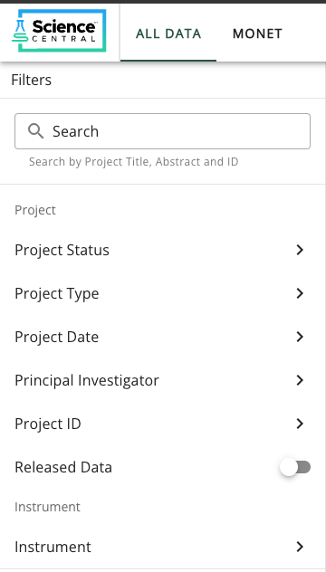

After the selections are made by user, search results appear as a scrollable list of projects on the screen. The title of the project can be clicked on to view more details about the project as members, project status, and data availability. Each project in the list that has data available will have a "Select Datasets" button. 

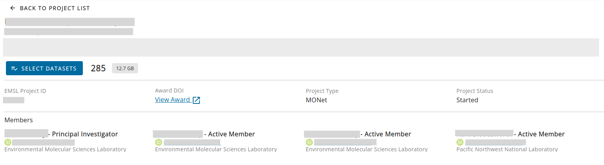

Users can click on the "Select Datasets" button to open up the dataset selector. From here, users can select datasets and either add them to the cart (enabling downloads of data across multiple projects), or download only the chosen datasets (note that this functionality might change in the future).

Users can also see more details such as the DOI and files of an individual upload by clicking the DOI button. Each dataset has its own URL that can be shared between users. Users can add files to cart and/or download from here as well.

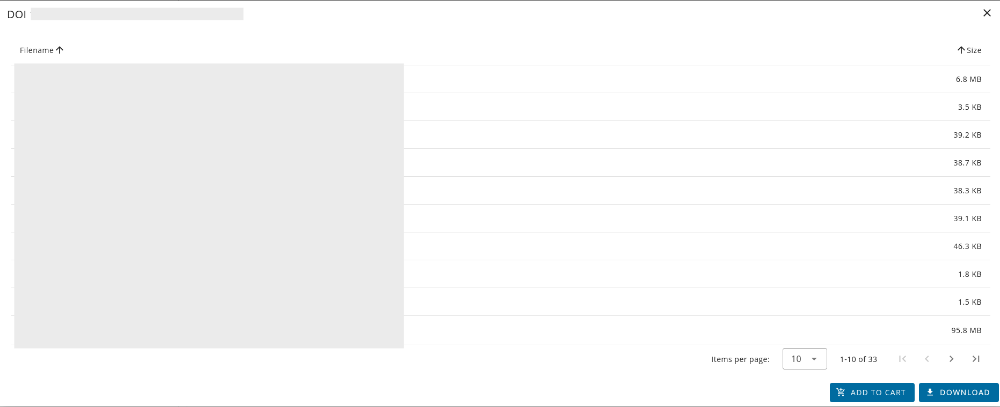

With projects in the cart, users can see more information in the top app bar about the state of their cart which includes information about number of uploads and size. Clicking the top most cart icon will show users the projects currently in their cart. Users can go back to the project list by clicking the "cart icon" in the top app bar or clicking "Back to project list" text under the top bar on left corner.

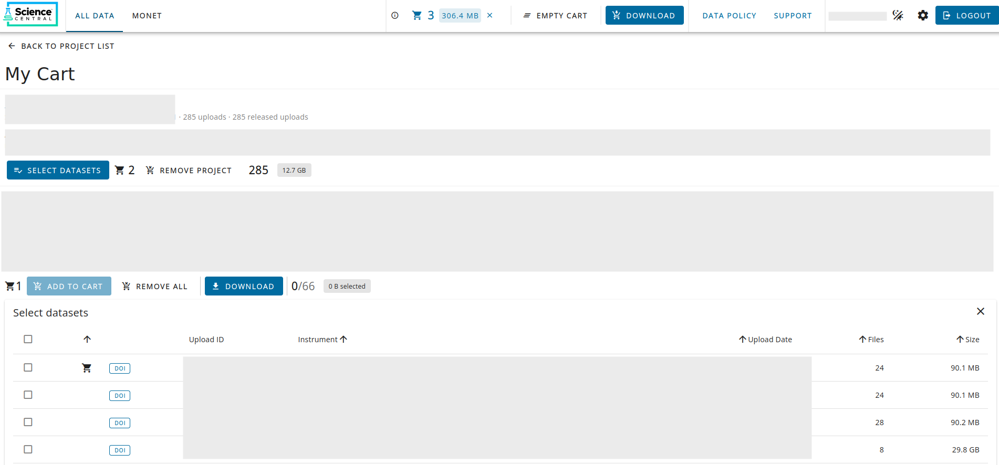

Once the user is ready with all the data for download, clicking on "Download" button in the top app bar brings up the download modal. Modal has two options to select the download destination as local machine(this computer), and Globus.

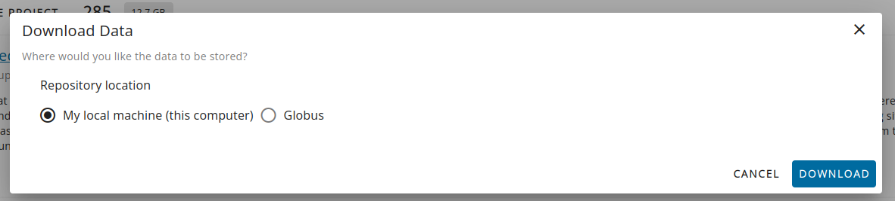

#### Transfer Methods

The Data Portal offers two distinct transfer methods for downloading datasets:

**Local Download (Direct Browser Download):**
- Available for cart sizes less than 10GB.
- Downloads directly to your computer through the browser.
- Best for smaller datasets and quick access.
- No additional account setup required.
- Files download immediately to your default download location.

**Globus Integration (High-Performance Transfer):**
- Required for cart sizes larger than 10GB.
- Enables high-performance file transfer for large datasets.
- Requires a Globus account to be linked to your Data Portal profile.
- Provides reliable transfer with automatic retry capabilities.
- Better for large-scale data transfers and institutional repositories.
- Supports transfer management and monitoring through Globus interface.

To use Globus transfers, users must link up a Globus ID. This can be done from the user settings (the gear icon next to the login/logout button) on the top bar.

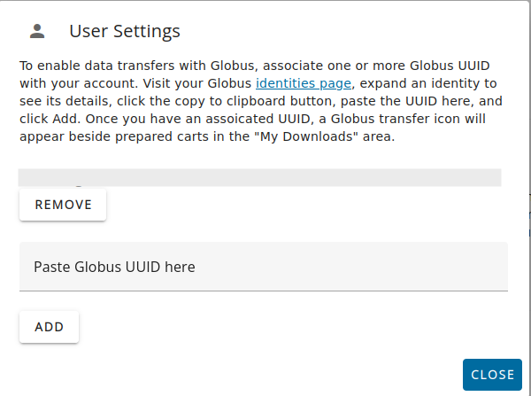

If the user already have a globus account configured in the Data Portal, they can select it when doing a globus transfer through download.

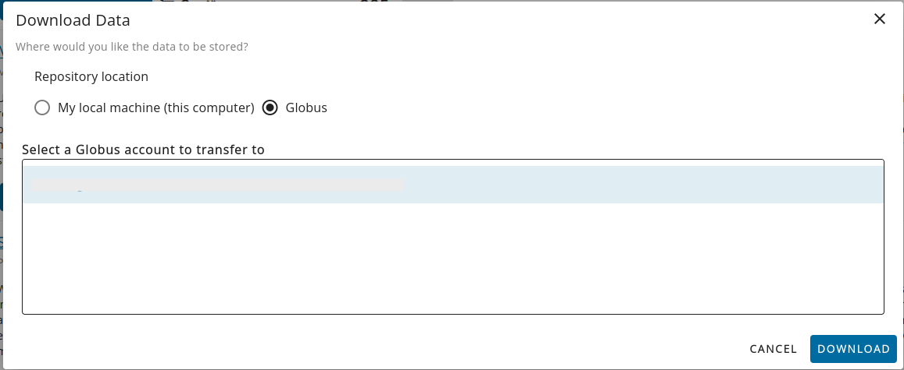

After the user selects the globus id and clicks "download" button, the status of that action will be displayed in the download modal until the download is complete.

### MONet tab

In the MONet search sidebar, different search facets are grouped together in collapsable sections. Users can adjust these filters to their needs. The free text search adds a filter that matches Project ID, title, or abstract. Users can expand/collapse all sections, and select show only active filters, or clear the current search from the top section of the search sidebar.The search sidebar in the MONet tab looks as below.

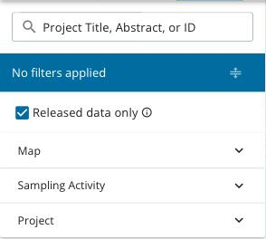

For MONet, the main view contains a map annotated with the location of samples. Users can click zoom and pan, and click "Search Visible Region" to add a latitude/longitude filter to the samples. Users can see more information by opening the bottom panel of the view, they can see information about the current samples and projects that those samples belong to.

#### MONet Map Controls

The MONet interface provides interactive map-based data discovery with the following controls:

**Search Visible Region:**
- Enables geographic filtering based on the current map view.
- Click this button to filter samples by latitude/longitude within the visible map area.
- Useful for finding region-specific research data.
- Applied filter appears in the active filters list and can be cleared.

**Reset Map:**
- Returns the map to the default global view.
- Clears any geographic zoom or pan adjustments.
- Does not clear other applied filters.
- Use this to start fresh with map exploration.

**Additional Map Features:**
- Zoom controls for detailed geographic exploration.
- Pan navigation to move across different regions.
- Location markers showing sampling sites.
- Interactive selection of sample points.

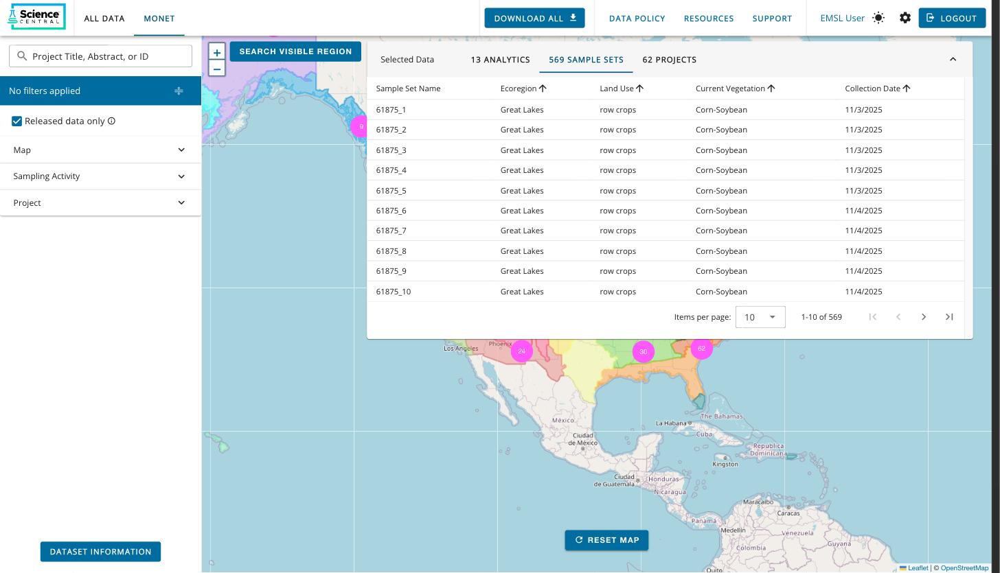

As shown below on the "Analytics" tab, users can filter data by various analytic analysis results.

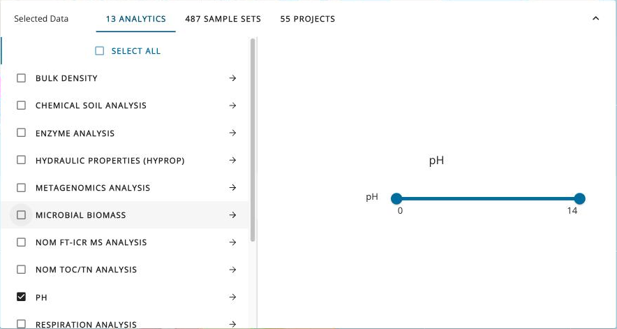

Users can toggle the filter using the switch on the left. The "include in download" switch controls whether or not the currently selected analysis type will be included in the download. Users can initiate a download for MONet data by clicking download in the Actions button "Actions" -> "Download".

**Note**: MONet downloads do not require a Globus connection. All MONet data can be downloaded directly without Globus account setup.

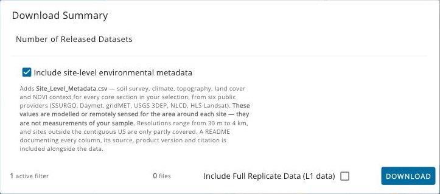

The download modal shows a summary of the download and the current filters. Clicking download on the modal initiates a download of a zip file containing the requested data.

## All Data vs MONet: Download Workflow Comparison

The Data Portal offers two distinct interfaces with different download approaches. Use this comparison to determine which interface best suits your needs:

| Feature | All Data Tab | MONet Tab |
|---------|-------------|-----------|
| **Primary Focus** | Individual project discovery and dataset selection | Geographic and analytical data discovery for MONet projects |
| **Discovery Method** | Project database browsing with filters | Interactive map-based geographic exploration combined with filters |
| **Selection Process** | Individual dataset selection from multiple projects | Bulk filtering by analytics type and geographic region |
| **Download Workflow** | Select datasets → Configure → Download | Filter data → Download |
| **Data Organization** | Project-centric with detailed dataset metadata | Sample and analytics-centric with standardized protocols |
| **Download Granularity** | Individual files and custom dataset configurations | Bulk standardized data packages |
| **Cart System** | Multi-project cart with selective file choices | No cart system - direct bulk download |
| **Globus Requirement** | Required for downloads larger than 10GB | Not required - all downloads are direct |
| **Transfer Options** | Local download (<10GB) or Globus (>10GB) | Direct zip download regardless of size |
| **Primary Use Case** | Targeted research data needs across various projects | Large-scale spatial/analytical dataset analysis for MONet |
| **Data Volume** | Configurable based on user selection | High-volume bulk downloads (thousands of files typical) |

### When to Use Each Interface:

**Use All Data Tab when:**
- You need specific datasets from particular projects.
- You want to review and select individual files before downloading.
- You need custom download configurations.
- You're working with data from multiple different project types.
- You need to manage downloads with a cart.

**Use MONet Tab when:**
- You need comprehensive geographic datasets from MONet projects.
- You want standardized analytical data (pH, soil analysis, etc.).
- You need bulk downloads for large-scale analysis.
- You're filtering data by sample location or analytics type.
- You prefer direct downloads without Globus setup.

## Download History and Management

The Data Portal provides a comprehensive download history interface that allows users to track and manage all their past downloads. This feature is accessible from the user menu and provides the following capabilities:

### Viewing Download History

The Past Downloads interface displays:
- **Name**: The download name assigned by the user to the collection at the time of download.
- **File Count**: Total number of files in each download.
- **Size**: Complete dataset size for each download.
- **Status**: Current status monitoring (Processing, Ready for Download, etc.).
- **Download**: Button to download or re-download the collection.
- **View in Globus**: Option to create a Globus collection for the download.

### Download Management Actions

Users can perform the following actions on past downloads:

**Re-download Capabilities:**
- Initiate a new download of the same dataset without rebuilding the cart.
- Useful for re-acquiring data or sharing with collaborators.
- Maintains the same file selection and configuration.

**Globus Transfer Management:**
- View Globus transfers directly from the download history.
- Access Globus transfer interface for monitoring large transfers.
- Manage transfer data and configurations.

**Download Cleanup:**
- Delete completed downloads from history to keep the interface organized.
- Remove failed or cancelled downloads.

### Globus Account Integration

The download history integrates with your linked Globus accounts:
- Track all Globus-based transfers in one location.
- Support for multiple Globus account associations.
- User account linking maintained across sessions.
- Transfer history synchronized with Globus platform.

### Status Monitoring

Real-time status tracking provides:
- **Processing**: Download preparation in progress.
- **Complete**: Download successfully finished and available.
- **Failed**: Download encountered errors (with error details).
- **In Progress**: Active transfer ongoing (for Globus transfers).
- Download completion notifications.