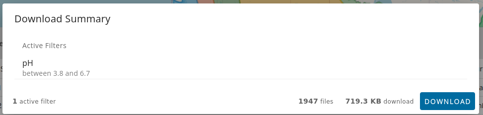

# Data Portal

## Introduction

Environmental Molecular Sciences Laboratory's (EMSL's) Data Portal provides users the ability to download project data across a variety of EMSL projects. Users can use search filters to find projects that they are interested in, create a cart with datasets across those projects, and either download those data to their computer or create a shared collection in Globus that they can access. Additionally, the data portal has functionality specifically for MONet projects, where users can similarly filter sample analytics data and download that analytics data. This includes a variety of analysis like pH, Elemental Analysis, etc.

Data Portal allows users to browse and search through projects data without logging in but login is required for download functionality.

## About Data Portal tabs

Data Portal has two primary pages "All Data" and "MONet". All Data is a project-oriented search across all project types, whereas MONet is a sample-oriented search pertaining to MONet projects only. In both views, users can use the search sidebar to add filters to the results. Users can toggle between the 2 views using the tabs at the top of the page.

### All Data tab

For All Data tab the search bar on the side looks as below,

After the selections are made by user, search results appear as a scrollable list of projects on the screen. The title of the project can be clicked on to view more details about the project as members, project status, and data availability. Each project in the list that has data available will have a "Select Datasets" button. 

Users can click on the "Select Datasets" button to open up the dataset selector. From here, users can select datasets and either add them to the cart (enabling downloads of data across multiple projects), or download only the chosen datasets (note that this functionality might change in the future).

Users can also see more details such as the DOI and files of an individual upload by clicking the DOI button. Each dataset has its own URL ([sc-data-dev.emsl.pnl.gov/doi/](sc-data-dev.emsl.pnl.gov/doi/)<upload_id>) that can be shared between users. Users can add files to cart and/or download from here as well.

With projects in the cart, users can see more information in the top app bar about the state of their cart which includes information about number of uploads and size. Clicking the top most cart icon will show users the projects currently in their cart. Users can go back to the project list by clicking the "cart icon" in the top app bar or clicking "Back to project list" text under the top bar on left corner.

Once the user is ready with all the data for download, clicking on "Download" button in the top app bar brings up the download modal. Modal has two options to select the download destination as local machine(this computer), and Globus.

User can perform local machine downloads if the cart size is less than 10GB. If the cart is larger than 10GB, they must download the data through Globus, and in order to use globus, users must link up a globus ID. This can be done from the user settings (the gear icon next to the login/logout button) on the top bar.

If the user already have a globus account configured in the Data Portal, they can select it when doing a globus transfer through download.

After the user selects the globus id and clicks "download" button, the status of that action will be displayed in the download modal until the download is complete.

### MONet tab

In the MONet search sidebar, different search facets are grouped together in collapsable sections. Users can adjust these filters to their needs. The free text search adds a filter that matches Project ID, title, or abstract. Users can expand/collapse all sections, and select show only active filters, or clear the current search from the top section of the search sidebar.The search sidebar in the MONet tab looks as below.

For MONet, the main view contains a map annotated with the location of samples. Users can click zoom and pan, and click "Search Visible Region" to add a latitude/longitude filter to the samples. Users can see more information by opening the bottom panel of the view, they can see information about the current samples and projects that those samples belong to.

As shown below on the "Analytics" tab, users can filter data by various analytic analysis results.

Users can toggle the filter using the switch on the left. The "include in download" switch controls whether or not the currently selected analysis type will be included in the download. Users can initiate a download for MONet data by clicking download in the Actions button "Actions" -> "Download".

The download modal shows a summary of the download and the current filters. Clicking download on the modal initiates a download of a zip file containing the requested data.

