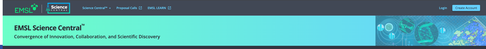
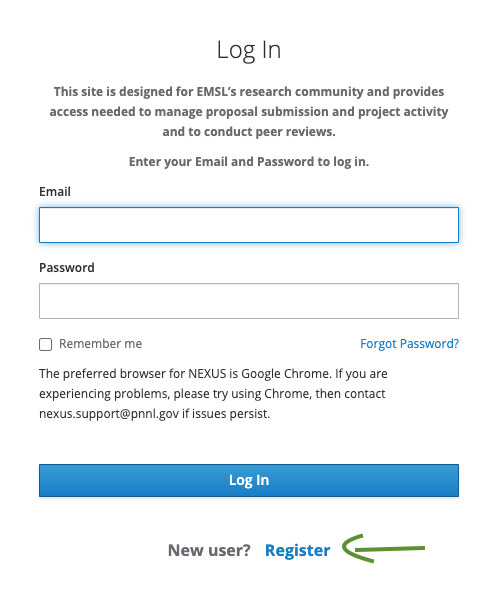
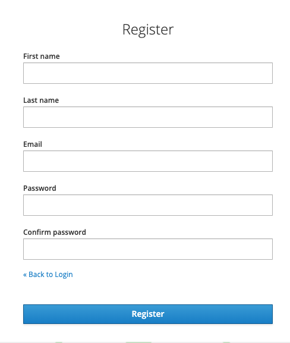
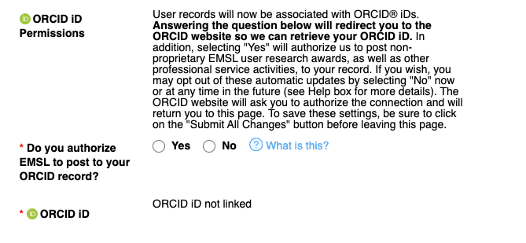
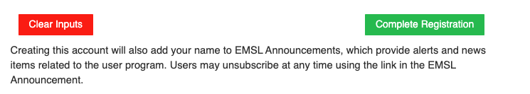

# Getting started with Science Central™

If you are a new participant or user and have never used Environmental Molecular Sciences Laboratory (EMSL) system, please follow the steps below to create an account through EMSL's Science Central™.

## Steps to create account

1. Go to [Science Central](https://sc.emsl.pnnl.gov/) and click on "Create Account" button on top right corner of the screen.

2. After clicking on "Create Account" button user will be redirected to NEXUS Login page with a login form, at the bottom of the form there is a text which says
"New user? Register". User is supposed to click on "Register" to get started with the registration process.

3. After "Register" is clicked, a new form comes where user is supposed to fill their first name, last name, email, password and confirm password fields. 
Once all the blank boxes are filled, user should click "Register" button which is at the bottom of the form.

4. After the "Register" button is clicked, "New User Form" shows up, user should fill all the details in the form.
User should select "Orcid Id permissions" to ensure the orcid id is linked to the user account, after clicking either "yes" or "no", user is taken to the ORCID sign in form where user can either login with existing credentials or create a new account by clicking "Register now". If the user is logging in with existing credentials after they click login they would be taken back to the "New User Form" and if user is registering a new account, in the last step after user clicks on either authorize access or deny they will be taken back to "New User Form" highlighting their inital selection.

5. After filling all the details user should click on "Complete Registration" button to successfully complete account creation process.

6. Once the "Complete Registration" button is clicked, user is taken back to the main page of Science Central™ as a logged in user.

Users can also follow the same steps of registration from [Nexus user portal](https://nexus.emsl.pnnl.gov/Portal) where after the successful registration user is taken back to the Nexus home page.

