# Globus account association

If you are downloading a cart whose size is more than 10 GB, a <a href="https://www.globus.org/get-started" target="_blank">Globus</a> account is needed to download data reliably and efficiently. Once a Globus account is created, it needs to be associated with your Science Central™ account.

If you do not have a Globus account associated with your Science Central account, the following message is seen when trying to download a cart.

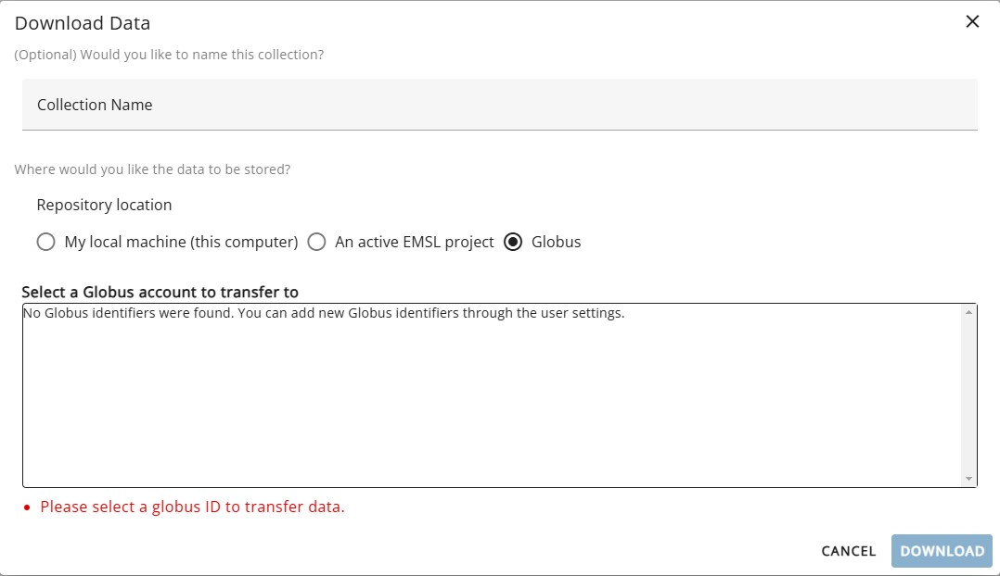

## Steps to create a Globus account
1. Go to <a href="https://www.globus.org/" target="_blank">Globus</a> website. You will be prompted to login with a screen. If your organization is listed, choose that to log into Globus. If not, sign in with Github or Google or ORCID iD. The following images are shown with a Google sign in.

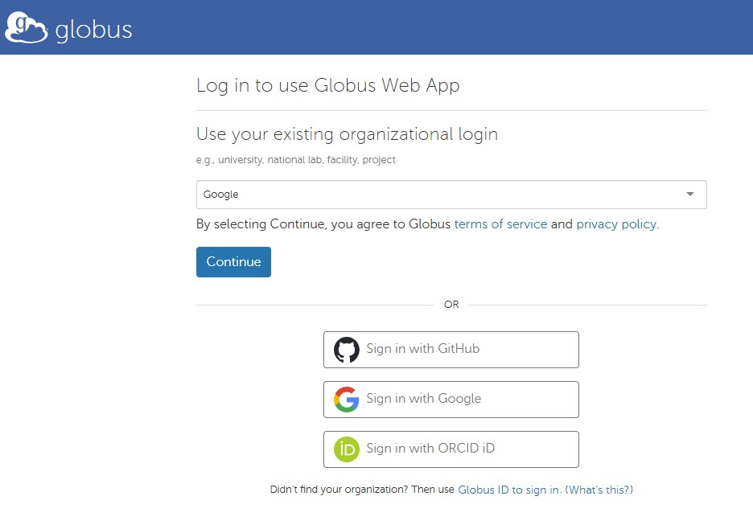

2. Once you sign into Globus, click on “Settings” on the left navigation bar.

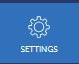

3. From the Settings screen, copy the Globus ID. Make sure the down arrow is clicked to expand the chosen identity. This reveals the details shown below.

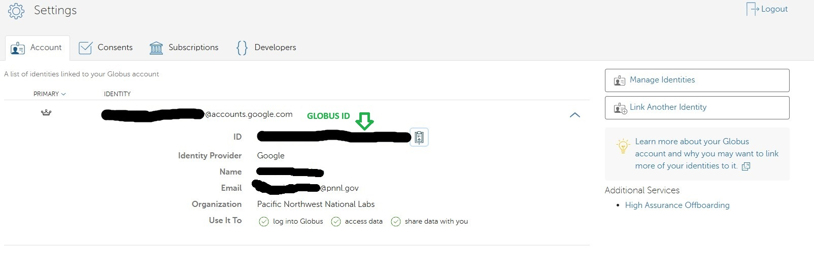

## Steps to associate the Globus ID
1. Go to Science Central/Data card and choose the gear icon as shown below. The user needs to be logged into Science Central to see the gear icon.

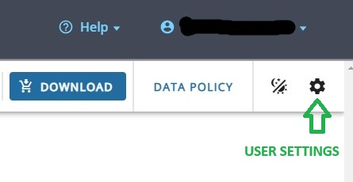

2. The following “User Settings” screen pops up. Paste the Globus ID into the “Paste Globus UUID here” field and click “Add”. After the add is successful click the “Close” button.

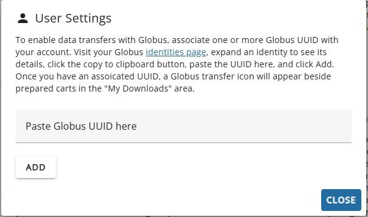

## Example download steps
Once the files are chosen, click the "DOWNLOAD" button.

1. From the Download Data screen, choose “Globus” as the delivery method, select your Globus ID and click the “Download” button.

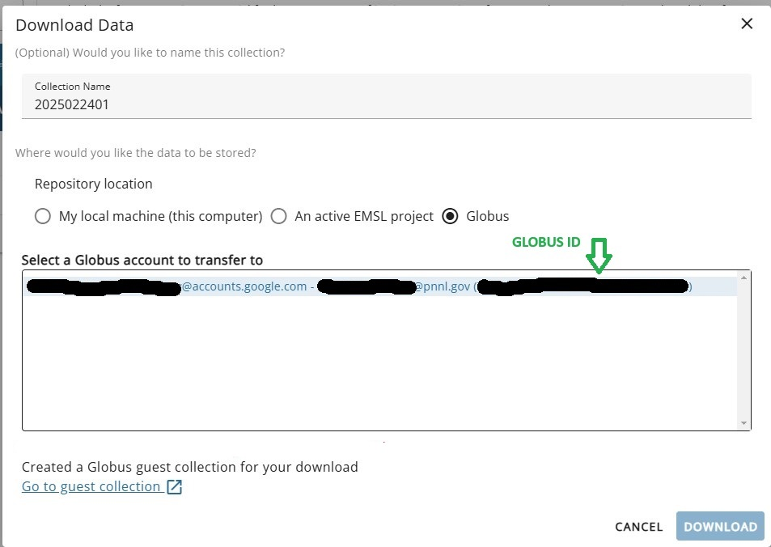

Your download is prepared in the background. In the “Download Information” window, click “Go to Past Downloads”. Once the download is ready, click “Visit Globus Collection” for it on the “My Downloads” page. If no collection has been created yet, click “Create Globus Collection” first.

2. You will be prompted with a Globus login screen.

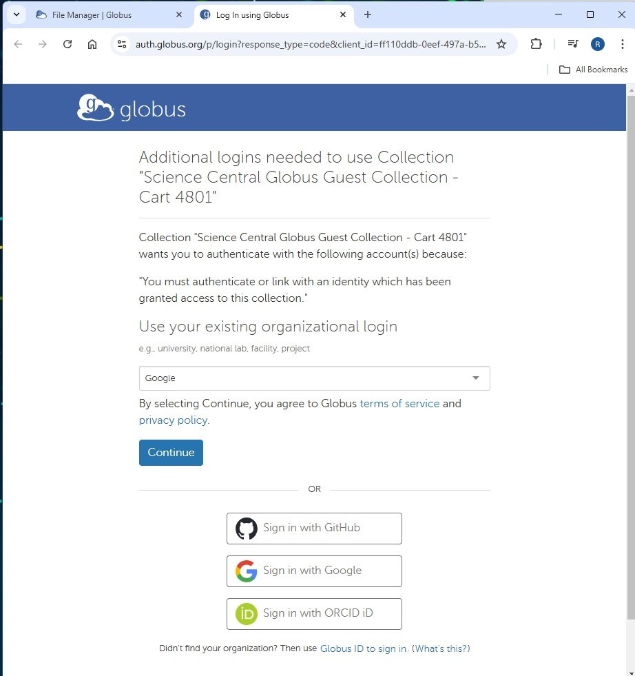

3. Once you log in, the following permission screen appears. Click on “Allow” button.

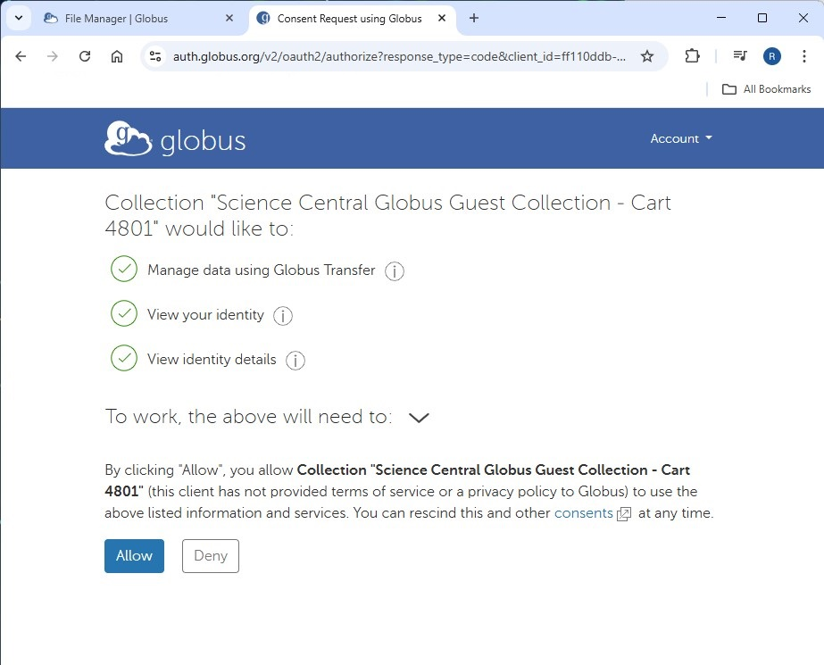

4. The collection appears as shown below.

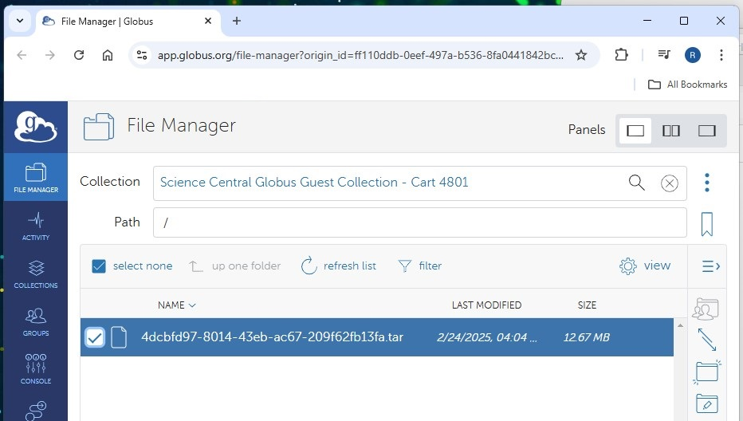

5. After selecting the collection, right click and choose “Download”.

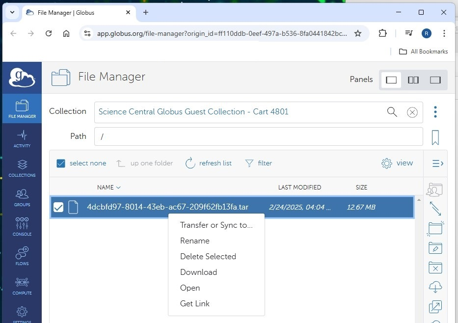

6. The download will start. The following screen shows the image after the download is completed.

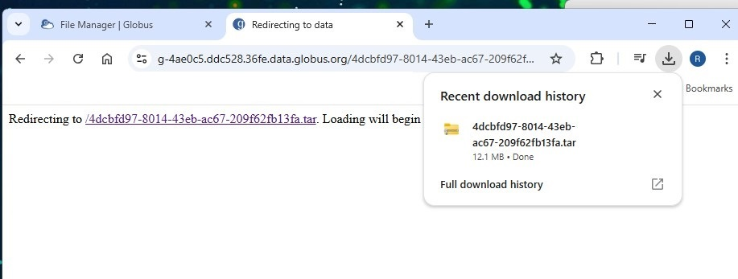