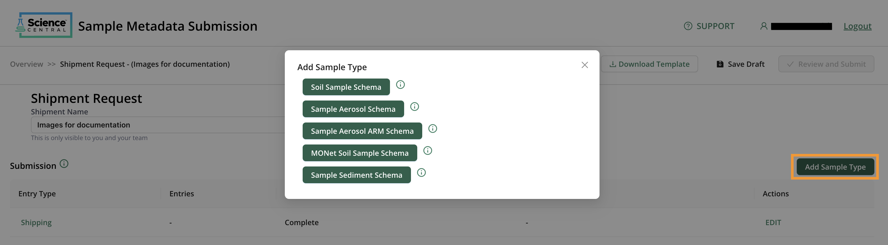

# Detailed How-To Guide for Metadata Input

## Background

The Environmental Molecular Science Laboratory (EMSL) launched EMSL [Science Central™](https://sc.emsl.pnnl.gov/) in May 2024. Science Central™ includes a comprehensive data portal that provides scientific datasets to enhance research findings. Users can also submit and manage proposals with proposal management. Additionally, they can integrate sample metadata utilizing the metadata management system.

Our metadata management system aims to make data findable, accessible, interoperable, and reusable (FAIR). This is in accordance with the DOE policy to enable data re-use and persistence. As a DOE user facility, EMSL is working to enhance data re-usability and to adhere to FAIR data standards. EMSL leverages the community standards governed by the [National Microbiome Data Collaborative](https://nmdc-documentation.readthedocs.io/en/latest/overview/nmdc_overview.html) (NMDC) and other existing standards and ontologies, including the [Genomic Standards Consortium](https://www.gensc.org/index.html) (GSC), the [Environment Ontology](https://sites.google.com/site/environmentontology/) (ENVO), and the [Mass Spectrometry Ontology](https://bioportal.bioontology.org/ontologies/MS). EMSL is following existing metadata standards and requirements for data and metadata to enable interoperability and findability.

## How-To Submit Metadata for EMSL Projects

This How-To Guide assumes the individual submitting metadata has an accepted EMSL User Project, that they are associated with said project, and are prepared to submit metadata and ship samples to EMSL. If you are interested in a How-To Guide for submitting an EMSL Proposal, please see [here](https://www.emsl.pnnl.gov/proposals#submitting-a-proposal).  If you are a participant in an accepted EMSL Project and have never used an EMSL system before, please see [faqs](https://www.emsl.pnnl.gov/user-program/faqs) for more information
and for steps to create an account please see [registration](./create_account.md).

EMSL requires metadata to be submitted with all samples being shipped to the facility ([EMSL Data Management policy](https://www.emsl.pnnl.gov/data-management-policy)). Metadata should provide complete and concise machine-readable information to describe all samples and ensure FAIR data. To ship samples, metadata must be submitted and approved by the projects Metadata Point-of-Contact (MPOC).

### Submitting Metadata & Samples to EMSL

To begin your submission, head to the [Science Central™](https://sc.emsl.pnnl.gov/) webpage, and log in.

The metadata management system and the [Sample Metadata Submission Portal](https://sc-metadata.emsl.pnnl.gov/) are available via the “LIMS” tile. Login required for full functionality. Once logged in, the “Dashboard” will show all submitted metadata on approved projects that you are associated with. If no metadata submissions or shipment requests have been created, this dashboard will appear blank. To get started select “+ New Shipment Application.”

### Starting a new submission

When starting a new shipment, (#1) add a name that is understandable to you and anyone else associated with the project. For example, 42 soils from NEON, or use your user project number & a sample analysis summary, UP11111 water samples for metabolomics and proteomics. This name is exclusively for you and your team. After naming the submission, make sure to save your draft. This portal does NOT autosave, so select (#2) “Save Draft” often! Next, edit the “Shipping” entry type by clicking the word (#3) “EDIT.”

### Shipping Information

Enter information about the shipment that you will be sending. Provide the shipment condition for how the samples should be both shipped and stored. Include an estimated shipping date to let us know when you plan to ship. Keep in mind that once metadata is submitted, it can take up to 1 week for approval. When shipping temperature sensitive samples, you will need to ship on a Monday or Tuesday and will need confirmation that staff are available to receive your samples. As such, plan your metadata and shipment request accordingly to allow a minimum of 1 week for approvals and shipping on appropriate days.

Next you will complete the “Receiving Information” section and select an estimated shipping date, and the EMSL Project and Sample Group to which these samples are associated with. It is important to select the correct EMSL Project for the shipment for subsequent fields to load correctly. If you know which EMSL staff member should receive your samples, you can add them here; however, this is not required.

You can only select one sample group per shipment, so if you plan to send samples from multiple groups, it will require additional submissions. If the listed sample groups created during proposal submission do not align with the samples being shipped, contact your EMSL project manager to create a new group on your behalf. Please note, your project manager may have follow-up questions regarding this new sample group, hazards, or permit requirements.

Once a sample group has been selected, the risks that were identified during proposal submission will load. Please review the risks. If any of these risks have changed, select “Yes,” and indicate which of the risk categories have changed.

The last step for the shipping information will be to provide information regarding the delivery method. If you plan to visit on-site and want to bring samples with you, select “In-Person Delivery.” For any other case, you will want to ship through a shipping carrier. Please note, shipments expenses are not covered by EMSL. If you, the submitter, are not shipping the samples and someone else is the shipper, enter the shipper’s information in the “Shipper” sections. The individual listed will receive shipping details.

Once finished, make sure to save draft. To move onto the next step, select “Shipment Request” in the top left corner.

### Samples & Metadata

Once back to the main “Shipment Request” page, select “Add Sample Type” to see the sample type schemas available for LIMS submission. If none of the sample types listed align with your samples, contact your EMSL metadata point-of-contact (MPOC) or email <emsl-metadata@pnnl.gov>.

You can include multiple sample type schemas in one shipment, unlike sample groups. For brevity, we will proceed with the “Soil Sample Schema” moving forward.

There are two mechanisms in which to enter sample metadata. Firstly, by entering the data directly into the web as shown in the table below. Secondly, by (#1) downloading an excel template, completing metadata via excel, and (#2) uploading the completed metadata file.

For the table, only required attributes will show, but there are optional attributes that can be added. If an optional attribute applies to your samples and showcases any differences between samples, please select it from the list on the left. The aim in metadata is to understand how the samples differ. This is highly specified for individual samples and adheres to existing metadata standards. As such, there are many attributes that you can search through to find the correct one. If none of the attributes convey the correct detail, you can select other.

Once data has been entered into the web table, you will want to verify that the format is correct. For this, see the image below, select the (#1) “Validation” tab. This will review the entered data and notify you of errors. Any errors in required terms will show up with (#2) a red background and errors in optional terms will have (#3) an orange background. An error message will appear (#4) on the left-hand side to help resolve any errors. After resolving any error select “Re-validate Sample Entries.” This will update and confirm your changes. 

All errors must be resolved for the “Review and Submit” button to turn green. Once that has changed from gray to green, you can submit. Remember to select “Save Draft” often!

Please remember that if you have additional samples of a different type that need a different schema type, you will want to instead “Save Draft” and select “Shipment Request” to add another sample type schema.

Once all schemas are completed with no errors, you will be able to submit. You can save your valid metadata by clicking the “Download Metadata” button. This will export all metadata you’ve entered to a .csv file.

### Submitting 

Upon submission, a pop-up will show with additional information. The submitter will receive an automated email regarding the submission. Once submitted, the Metadata Point-of-Contact (MPOC) will review the submission. Please allow 3 days for a response and up to 1 week for shipping information. Remember that shipping details will go to the listed shipper. This may be different than the individual submitting the request.

If your shipment requires UDSA permitting, then the Project Manager for your project will follow-up with the required documentation. Shipping requirements differ for domestic and international shipments. Please work closely with your Project Manager regarding this documentation.

### Updating your submission

After a review from the MPOC, a submission may be returned for edits. In this case, you will receive an additional email. Head back to the [Sample Metadata Submission Portal](https://sc-metadata.emsl.pnnl.gov/) dashboard. Select the shipment name with the status showing “User Revisions Required” to get started with updates.

Requested updates will be provided via comments. To view any entered comment from the MPOC, go to the sample metadata section select “EDIT”. Navigate to the “Comments” tab to see the message from your MPOC for requested updates.

Once complete, you can select “Review and Submit” again to route back to the MPOC.
Multiple rounds of revision may be required before metadata is fully completed. Once approved, the shipper will receive the shipping details.