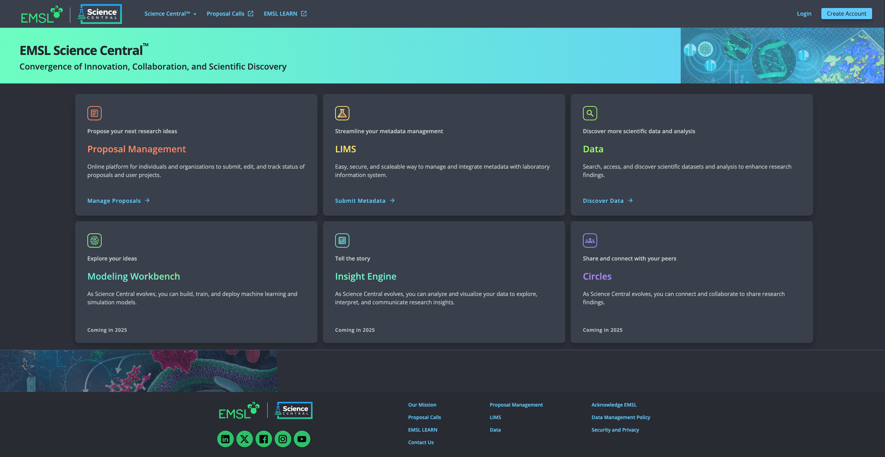
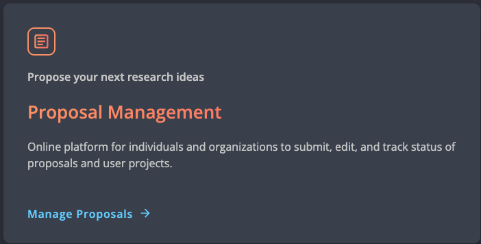
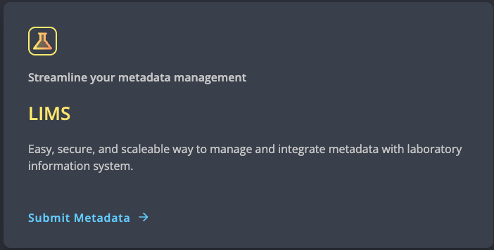
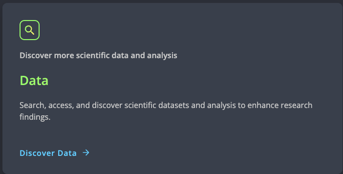
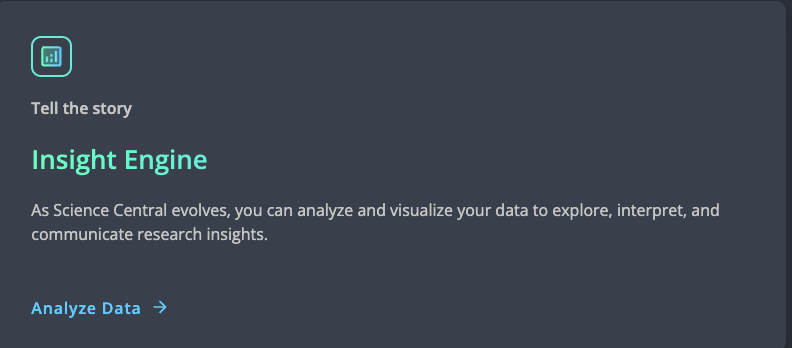
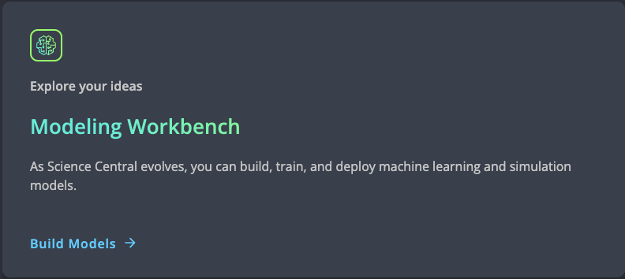
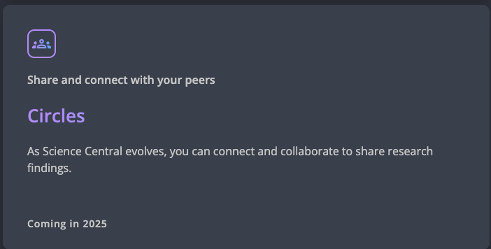

Welcome to Science Central™
============================

Science Central™ is an innovative and comprehensive platform provided by the Environmental Molecular Sciences Laboratory (EMSL) to revolutionize scientific investigations and research
conducted at EMSL. It is a centralized project management, data analysis, visualization, collaboration and knowledge sharing hub, offering a seamless and integrated environment to accelerate 
scientific discovery. Science Central™ offers seamless access to scientific data through Data Portal and variety of tools such as Modeling Workbench and Insights Engine to its users.
It empowers researchers to maximize their research potential, fostering a vibrant scientific community and driving impactful discoveries in fields such as environmental sciences, 
materials research, and energy innovation. Serving as a hub, Science Central™ has multiple embedded web applications, each built and tailored with specific research needs and 
workflows.

About applications of Science Central™
=======================================

Here is the overview of the key components and applications of Science Central™

1. `Proposal Management <https://nexus.emsl.pnnl.gov/Portal>`_: 
    Proposal Management system of Science Central™ streamlines and facilitates the process of research proposal submission, review and tracking, 
    ensuring efficiency and collaboration among project participants and coordinators. It helps researchers to manage their resources through resource management component 
    which enables researchers/users to allocate and manage project resources efficiently. The platform also provides tools for tracking resource usage, including equipment, 
    materials, and personnel, ensuring optimal resource allocation.

2. `Laboratory Information Management System (LIMS) <https://sc-metadata.emsl.pnnl.gov/>`_:
    LIMS application of Science Central™ helps users and researchers to submit and manage their sample metadata. It also facilitates sample shipment and tracking.  

3. `Data Portal <https://sc-data.emsl.pnnl.gov/>`_:
    Data Portal of Science Central™ is the central repository for storing, accessing, managing and downloading data generated by research at Environmental Molecular Sciences Laboratory (EMSL).
    It is designed and developed based on findable, accessible, interoperable, and reusable (FAIR) principles.

4. `Insight Engine <https://sc.emsl.pnnl.gov/>`_:
    Visualization component of Science Central™ allows researchers to create interactive and visually compelling representations of their research data. It offers a variety of visualization 
    techniques, such as charts, graphs, and 3D visualizations,to facilitate data exploration and interpretation.

5. `Modeling Workbench <https://sc.emsl.pnnl.gov/>`_:
    Modeling Workbench is a powerful component of Science Central™, that integrates artificial intelligence and machine learning capabilities into the platform. It allows researchers to apply advanced 
    algorithms and techniques to their data for predictive modeling, pattern recognition, and data-driven insights.

6. Circles: 
    Science Central™'s collaboration component fosters interdisciplinary collaboration and knowledge sharing among researchers. It provides communication channels, discussion forums, and 
    document-sharing capabilities to facilitate seamless collaboration and feedback exchange.

Support and Help
=================

 For general Science Central™ access issues, questions related to web application, and to provide feedback reach out to sc.support@pnnl.gov.

