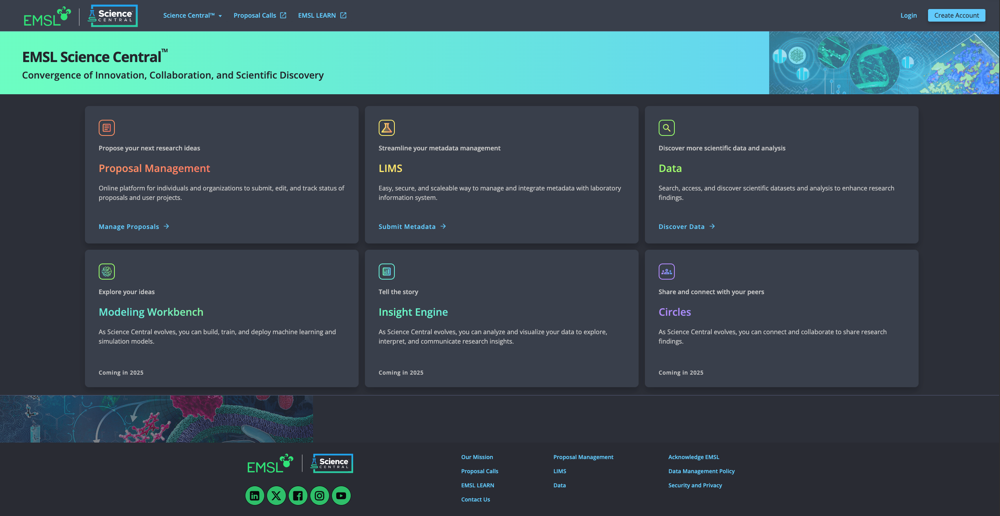
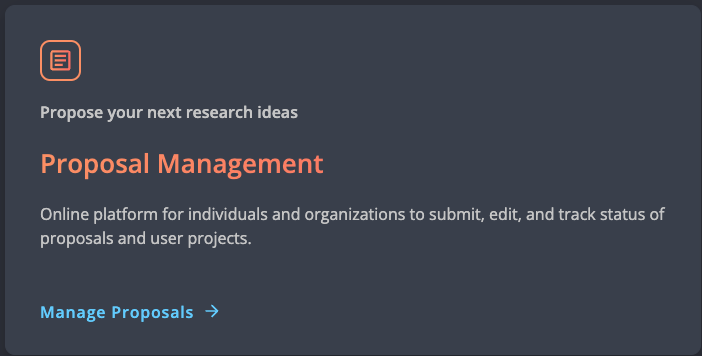
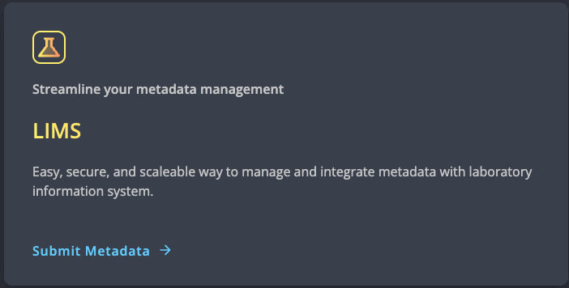
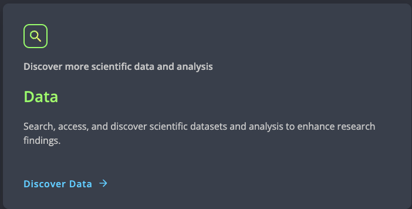
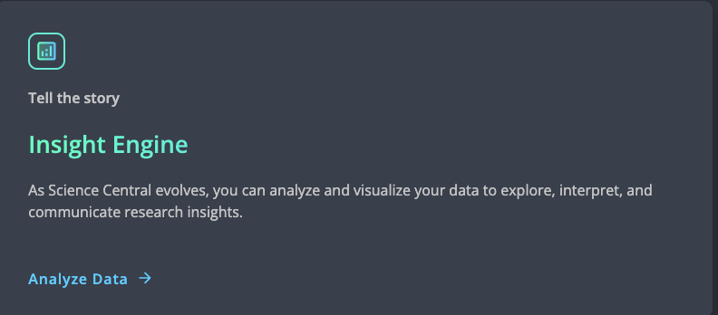
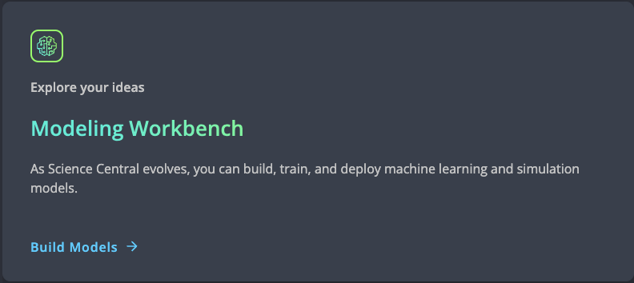
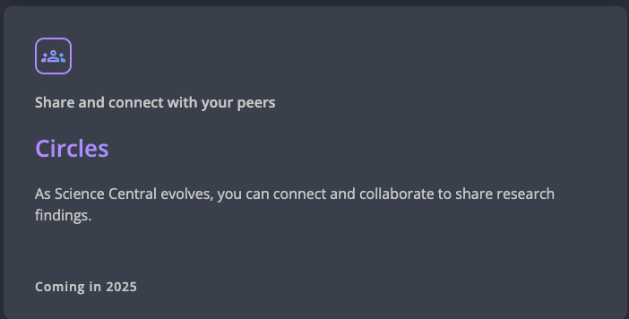

Welcome to Science Central™
============================

Science Central™ is an innovative and comprehensive platform provided by the Environmental Molecular Sciences Laboratory (EMSL) to revolutionize scientific investigations and research
conducted at EMSL. It is a centralized project management, data analysis, visualization, collaboration and knowledge sharing hub, offering a seamless and integrated environment to accelerate 
scientific discovery. Science Central™ offers seamless access to scientific data through Data Portal and variety of tools such as Modeling Workbench and Insights Engine to its users.
It empowers researchers to maximize their research potential, fostering a vibrant scientific community and driving impactful discoveries in fields such as environmental sciences, 
materials research, and energy innovation. Serving as a hub, Science Central™ has multiple embedded web applications, each built and tailored with specific research needs and 
workflows.

About applications of Science Central™
=======================================

Here is the overview of the key components and applications of Science Central™

1. `Proposal Management <https://nexus.emsl.pnnl.gov/Portal>`_: 
    Proposal Management system of Science Central™ streamlines and facilitates the process of research proposal submission, review and tracking, 
    ensuring efficiency and collaboration among project participants and coordinators. It helps researchers to manage their resources through resource management component 
    which enables researchers/users to allocate and manage project resources efficiently. The platform also provides tools for tracking resource usage, including equipment, 
    materials, and personnel, ensuring optimal resource allocation.

2. `Laboratory Information Management System (LIMS) <https://sc-metadata.emsl.pnnl.gov/>`_:
    LIMS application of Science Central™ helps users and researchers to submit and manage their sample metadata. It also facilitates sample shipment and tracking.  

3. `Data Portal <https://sc-data.emsl.pnnl.gov/>`_:
    Data Portal of Science Central™ is the central repository for storing, accessing, managing and downloading data generated by research at Environmental Molecular Sciences Laboratory (EMSL).
    It is designed and developed based on findable, accessible, interoperable, and reusable (FAIR) principles.

4. `Insight Engine <https://sc.emsl.pnnl.gov/>`_:
    Visualization component of Science Central™ allows researchers to create interactive and visually compelling representations of their research data. It offers a variety of visualization 
    techniques, such as charts, graphs, and 3D visualizations, to facilitate data exploration and interpretation. The Insight Engine provides a centralized environment for data analysis and visualization, 
    enabling researchers to analyze and visualize data to explore, interpret, and communicate research insights.

    Insight Engine includes the following applications (each opens in a new browser tab):

    - **Explore**: A Python-focused JupyterHub environment designed to accelerate your Python explorations and data analysis workflows.
    - **MAP (Multi-omics Analysis Portal)**: A suite of analysis tools built to filter, analyze, and integrate multi-omics data with specialized bioinformatics capabilities.

5. `Modeling Workbench <https://sc.emsl.pnnl.gov/>`_:
    Modeling Workbench is a powerful component of Science Central™, that integrates artificial intelligence and machine learning capabilities into the platform. It allows researchers to apply advanced 
    algorithms and techniques to their data for predictive modeling, pattern recognition, and data-driven insights. The Modeling Workbench provides a centralized environment for data scientists to build, 
    train, and deploy machine learning and simulation models.

    Modeling Workbench includes the following applications (each opens in a new browser tab):

    - **Data Science**: A JupyterHub environment fully equipped with a suite of libraries designed for powerful data processing and analysis, supporting Python, R, and Julia.
    - **TensorFlow**: A deep learning focused JupyterHub environment designed to advance your deep learning journey.
    - **Tahoma OnDemand**: An OpenOnDemand-based compute infrastructure platform for high-performance computing access.

6. Circles: 
    Circles is Science Central™'s collaboration component that provides Microsoft Teams chat integration for interdisciplinary collaboration and knowledge sharing among researchers. 
    When users click on the Circles card, they will be redirected to a new browser tab with Microsoft Teams if they have access. Users without access will see a tooltip indicating 
    "No access" with instructions to request access by contacting sc-collab-support@pnnl.gov. This platform facilitates seamless communication, and discussion 
    capabilities to enhance collaboration and feedback exchange among research teams.

Support and Help
=================

For general Science Central™ access issues, and questions related to web application reach out to sc.support@pnnl.gov.

Platform Service Status
========================

Science Central™ communicates platform issues and service impacts through banner notifications displayed at the top of the interface. 

**How Service Notifications Work:**

- **Banner Alerts**: When technical difficulties or maintenance activities impact Science Central™ products or compute resources, a prominent banner notification will appear at the top of all pages.
- **Status Information**: The banner provides details about which services are affected and the nature of the impact.
- **Resolution Updates**: When issues are resolved and full service is restored, the banner notification is removed.
- **Proactive Communication**: Planned maintenance and known issues are communicated in advance when possible.

If you experience issues and do not see a banner notification, or if you need additional information about a service impact, please contact sc.support@pnnl.gov.

Feedback
============

This feature is available for logged-in users only and we would greatly appreciate hearing about your experience with Science Central™.
Your valuable insights help us continually improve Science Central™ and create a better experience for all our users.

To share your thoughts with us please follow these steps:

1. Click the **Help** button in the top-right corner of the Science Central™.
2. Choose **"Send Feedback"** from the dropdown.
3. Fill out the brief form by selecting a topic from the dropdown menu.
4. Share your thoughts and suggestions.

